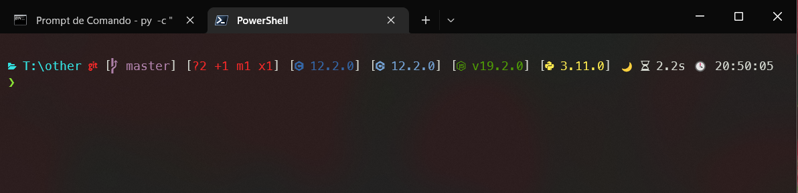

# ShellServer

It's a mix of [Starship](https://github.com/starship/starship) and [Zoxide](https://github.com/ajeetdsouza/zoxide) but faster.  
  
On Starship, every 'Enter' keystroke spawns a new process, which may cause a lag between prompts.  
Zoxide will raise a new process every time you call it.  
ShellServer raises the server only in the first shell creation and will _communicate_ with your shell on every 'Enter' keystroke.  
  
But if your hardware gives you a fluid shell experience using Starship, I recommend that you keep with it because it's way more customizable.  

## Features
  
### Prompt with a fast glance at what is in directory  

  
This is the most bloated prompt that you will get.
It will indicate the existence of Python, C, C++, Lua, Node and PowerShell files on directory.  
The compilers searched are GCC and G++.  
  
### No lag from spawning processes  

  
  
### Better 'cd'  

  
Note: [fzf](https://github.com/junegunn/fzf) is a dependency to use 'pz'  
  
### Switching Theme
  

Can take four arguments: all, system, terminal, and blue.  
terminal: Toggles Windows Terminal default theme between 'Tango Dark' and 'Solarized Light'.  
system: Toggles system wide Dark Mode.  
blue: Toggles 'Blue light reduction'.  
all: Same as not passing arguments. Do all the above.
  
### Searching history

### Listing directory

  
  
## CLI

The server knows how many clients it haves and will know if you quit shell with 'exit'  
but if window is closed on 'X' it may outlive the shell. 

~~~
usage: shellserver [-h] {kill,clear}

positional arguments:
  {kill,clear}  "kill" to kill the server, "clear" to clear the cache.

options:
  -h, --help    show this help message and exit
~~~

## Requirements

- Python 3.10+
- PowerShell 6.2 (I think)
- Any NerdFont (I use MesloGS NF)

## Installation

Currently, ShellServer will work only in PowerShell on Windows. A few things must change to make it work on Linux, so make an Issue if you want to use it. There are plans to get it to [Xonsh](https://github.com/xonsh/xonsh)

~~~PowerShell
> pip install shellserver  # or pip install --user shellserver
> Install-Module ShellServer -Scope CurrentUser
~~~

In your PowerShell profile:
~~~PowerShell
# By the beginning of the file
pythonw -m shellserver  # note the 'w'

# By the end of the file
Import-Module ShellServer
~~~

## Known Issues

- Git status brackets might give wrong values for now. ShellServer won't parse the 'git status' command because it would threaten performance. It deals with files directly.
- Prompt might be unstructured on a small window.
